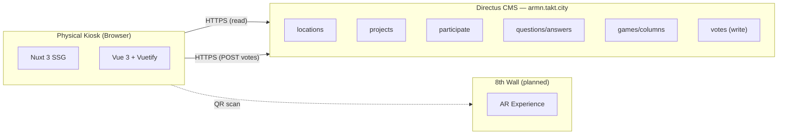
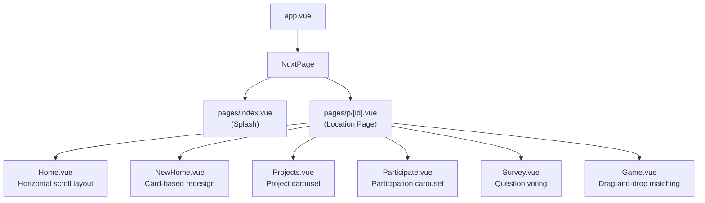
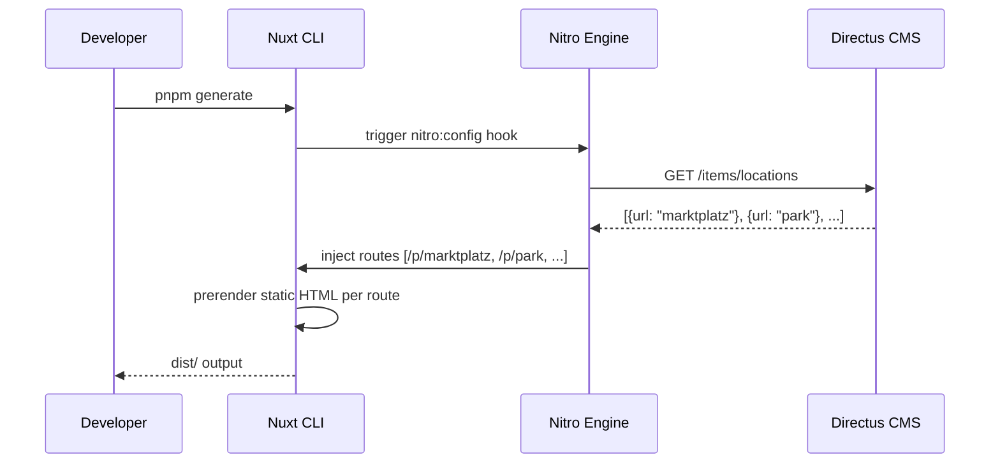
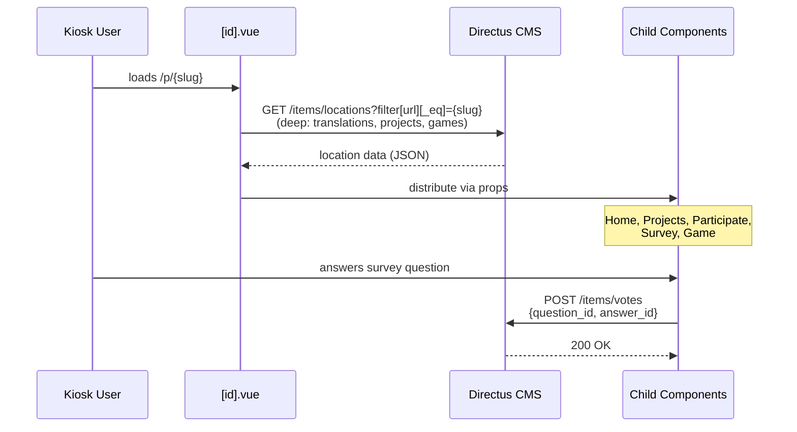
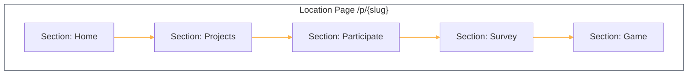
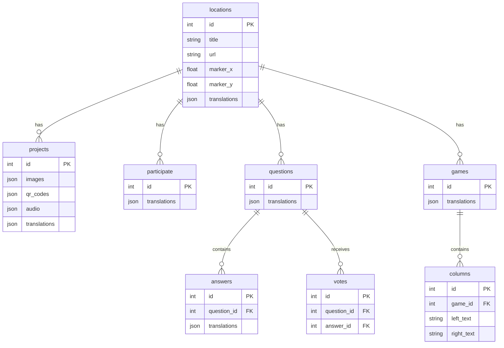

# Architecture

## System Overview

## Component Tree

## Build-Time Flow

## Runtime Data Flow

## Navigation Model

No client-side route navigation between locations. Each kiosk loads one URL. Within a page, navigation is **horizontal smooth-scrolling** between viewport-width sections.

## Directus Data Model

All content collections include a `translations` sub-array keyed by `languages_code` (`en`, `de`).

## Tech Stack

| Layer | Technology | Version | Purpose |
|---|---|---|---|
| **Framework** | Nuxt 3 | ^3.10.3 | SSG/SSR, routing, head management |
| **UI Library** | Vue 3 | ^3.4.19 | Composition API components |
| **Component Library** | Vuetify | via vuetify-nuxt-module ^0.12.0 | Material Design components |
| **Internationalization** | @nuxtjs/i18n | ^8.3.1 | English + German support |
| **Routing** | vue-router | ^4.3.0 | Client-side routing |
| **Package Manager** | pnpm | — | Dependency management |
| **Language** | TypeScript | via Nuxt | Config files; components use JS in `<script setup>` |
| **Server Engine** | Nitro | built-in | SSG prerender route injection |

### Backend / Data

| Technology | Detail |
|---|---|
| **CMS** | Directus (headless) at `armn.takt.city` |
| **Database** | Managed by Directus (not directly accessed) |
| **Auth** | Bearer token (static, read/write) |
| **Assets** | Served from Directus at `/assets/{uuid}` |

### Infrastructure

| Concern | Current State |
|---|---|
| **Hosting** | Static files (SSG output) — host not documented |
| **CI/CD** | None configured |
| **Containerization** | None |
| **Monitoring** | None |
| **Testing** | None |
