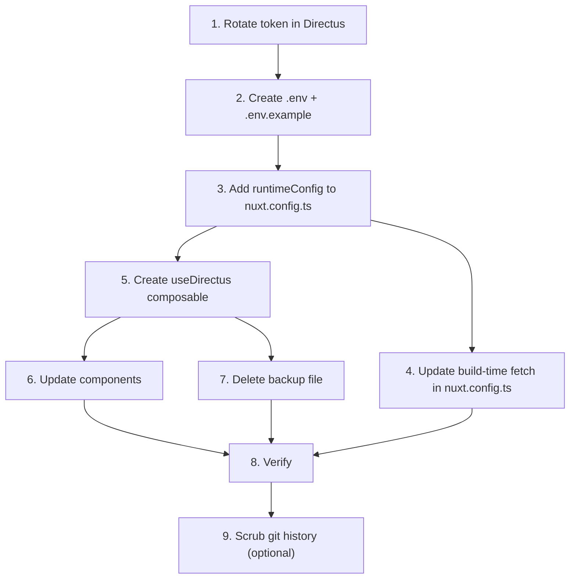

# Plan: Migrate Hardcoded Bearer Token to Environment Variable

**Priority**: Critical — token is exposed in a public repository
**Status**: Complete (2026-02-26) — token rotation (Step 1) and git history scrub (Step 9) remain manual tasks

## Problem

The Directus API bearer token `j04rZ3-...` is hardcoded in 3 source files and the API base URL `armn.takt.city` is hardcoded in 7 source files. Since this is a public repo, the token is visible to anyone. It grants read/write access to the Directus CMS (including posting votes).

## Affected Files

### Bearer token (3 files)

| File | Line | Context |
|---|---|---|
| `nuxt.config.ts` | 22 | `getLocations()` build-time fetch |
| `components/Survey.vue` | 126 | `registerVote()` runtime POST |
| `pages/p/[id]_backup.vue` | 162 | `loadLocation()` runtime fetch |

### Hardcoded API base URL (6 files)

| File | Lines | Context |
|---|---|---|
| `nuxt.config.ts` | 20 | Build-time location fetch |
| `components/Survey.vue` | 121 | Vote POST endpoint |
| `components/Game.vue` | 36, 65 | Asset image URLs |
| `components/Participate.vue` | 45, 58 | Asset image + QR URLs |
| `components/Projects.vue` | 28, 40 | Asset image + QR URLs |
| `pages/p/[id]_backup.vue` | 47, 160 | Audio source + location fetch |

## Steps

### Step 1 — Rotate the token (manual, Directus admin)

The current token is compromised since it's in git history. Before anything else:

1. Log into Directus admin at `armn.takt.city`
2. Generate a new API token
3. Revoke the old token (`j04rZ3-gVM-SyJlK-iAE1MH5HDbovh1u`)
4. Use the new token in all subsequent steps

### Step 2 — Create `.env` and `.env.example`

`.env` (git-ignored, never committed):
```env
DIRECTUS_API_URL=https://armn.takt.city
DIRECTUS_API_TOKEN=<new-rotated-token>
```

`.env.example` (committed, documents required vars):
```env
DIRECTUS_API_URL=https://your-directus-instance.example.com
DIRECTUS_API_TOKEN=your-token-here
```

`.gitignore` already has the correct rules (`.env` ignored, `.env.example` allowed).

### Step 3 — Add Nuxt `runtimeConfig` in `nuxt.config.ts`

```typescript
export default defineNuxtConfig({
  runtimeConfig: {
    // Server-only (build-time, SSG prerender)
    directusApiToken: process.env.DIRECTUS_API_TOKEN || '',

    // Available client-side
    public: {
      directusApiUrl: process.env.DIRECTUS_API_URL || '',
      directusApiToken: process.env.DIRECTUS_API_TOKEN || '',
    },
  },
  // ... rest of config
})
```

> **Note**: The token must be in `public` because the kiosk browser makes runtime fetch calls directly to Directus. The token is still "public" on the kiosk device — the goal here is to remove it from the **source code and git history**, not to hide it from end users. If server-side proxying is desired in the future, the token can move to server-only config behind a Nitro API route.

### Step 4 — Update `nuxt.config.ts` build-time fetch

Replace the hardcoded fetch in `getLocations()`:

```typescript
async function getLocations() {
  const apiUrl = process.env.DIRECTUS_API_URL
  const apiToken = process.env.DIRECTUS_API_TOKEN

  const response = await fetch(
    `${apiUrl}/items/locations?fields=id,title,url`,
    {
      headers: { Authorization: `Bearer ${apiToken}` },
    }
  )
  // ...
}
```

This runs at build time in Node, so `process.env` is available directly.

### Step 5 — Create a composable: `composables/useDirectus.ts`

```typescript
export function useDirectus() {
  const config = useRuntimeConfig()
  const baseUrl = config.public.directusApiUrl

  const headers = {
    Authorization: `Bearer ${config.public.directusApiToken}`,
  }

  function assetUrl(uuid: string): string {
    return `${baseUrl}/assets/${uuid}`
  }

  async function fetchItems<T>(collection: string, params: string = ''): Promise<T> {
    return $fetch(`${baseUrl}/items/${collection}${params}`, { headers })
  }

  async function postItem<T>(collection: string, body: Record<string, unknown>): Promise<T> {
    return $fetch(`${baseUrl}/items/${collection}`, {
      method: 'POST',
      body,
      headers,
    })
  }

  return { baseUrl, headers, assetUrl, fetchItems, postItem }
}
```

### Step 6 — Update components to use the composable

**`components/Survey.vue`** — replace hardcoded fetch:
```typescript
const { postItem } = useDirectus()

const registerVote = async (answer) => {
  await postItem('votes', { answer })
}
```

**`components/Game.vue`, `Participate.vue`, `Projects.vue`** — replace asset URLs:
```vue
<script setup>
const { assetUrl } = useDirectus()
</script>

<template>
  
</template>
```

**`pages/p/[id].vue`** — replace location fetch:
```typescript
const { fetchItems } = useDirectus()

const loadLocation = async () => {
  const { data } = await fetchItems('locations', `?fields=${fields}&filter[url][_eq]=${url}`)
  // ...
}
```

### Step 7 — Delete `pages/p/[id]_backup.vue`

This file is a duplicate of the active page. It contains a third copy of the hardcoded token. Delete it — use git history if the old version is ever needed.

### Step 8 — Verify

1. Create `.env` with the new rotated token
2. `pnpm dev` — confirm all pages load, images render, surveys submit
3. `pnpm generate` — confirm build-time prerendering still discovers all routes
4. `grep -r "j04rZ3" .` — confirm zero matches in source (old token fully removed)
5. `grep -r "armn.takt.city" --include="*.vue" --include="*.ts"` — confirm zero matches in source files (only docs may reference it)

### Step 9 — Scrub git history (optional but recommended)

The old token exists in git history. Options:

- **Preferred**: Rotate the token (Step 1) and accept that the old token is in history but revoked
- **Thorough**: Use `git filter-repo` or BFG Repo Cleaner to purge the token from all commits, then force-push (destructive — coordinate with all contributors)

## Dependency Diagram



## Risk

| Risk | Mitigation |
|---|---|
| Build breaks if `.env` missing | Step 8 verification; `.env.example` documents required vars |
| Kiosk deploys stop working | Test `pnpm generate` + `pnpm preview` before deploying |
| Old token still exploitable from git history | Step 1 rotates the token, making old one useless |
| Contributors forget to create `.env` | `pnpm dev` will fail visibly with empty API URL — hard to miss |
