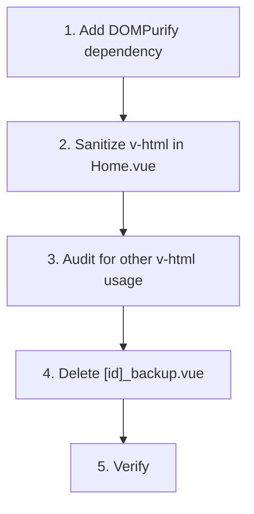

# Plan: Fix Stored XSS via `v-html` in Home.vue

**Priority**: High
**Status**: Complete (2026-02-26)
**Source**: Security review (2026-02-26)

## Problem

`components/Home.vue` line 82 uses Vue's `v-html` directive to render a `desc` prop sourced from the Directus CMS `description` field. `v-html` renders raw HTML without sanitization. If a CMS editor (or attacker with CMS write access) stores malicious markup in the `description` field, it executes as JavaScript in every kiosk visitor's browser.

The current active route (`pages/p/[id].vue`) has migrated to `NewHome.vue` which does **not** use `v-html`, so the vulnerability is not on the live code path today. However, `Home.vue` remains in the codebase and could be reintroduced.

## Affected Files

| File | Line | Status |
|---|---|---|
| `components/Home.vue` | 82 | `v-html="desc"` — vulnerable |
| `pages/p/[id]_backup.vue` | 36 | Passes `:desc="description"` to Home — dead code |
| `components/NewHome.vue` | — | Does not use `v-html` — safe |

## Steps

### Step 1 — Add DOMPurify

```bash
pnpm add dompurify
pnpm add -D @types/dompurify
```

### Step 2 — Sanitize in Home.vue

```vue
<script setup lang="ts">
import DOMPurify from 'dompurify'

interface Props {
  desc: string
}
const props = defineProps<Props>()

const sanitizedDesc = computed(() => DOMPurify.sanitize(props.desc))
</script>

<template>
  <p v-html="sanitizedDesc"></p>
</template>
```

### Step 3 — Audit for other `v-html` usage

```bash
grep -rn "v-html" --include="*.vue" .
```

If any other instances exist, apply the same DOMPurify treatment.

### Step 4 — Delete dead code

Remove `pages/p/[id]_backup.vue` entirely. It is a duplicate with its own copy of the vulnerability and the hardcoded bearer token. Use git history if the old version is ever needed.

### Step 5 — Verify

1. `pnpm dev` — confirm Home.vue renders descriptions correctly
2. Test with a CMS description containing `` — confirm the script does **not** execute
3. Confirm DOMPurify strips dangerous tags/attributes while preserving safe formatting HTML

## Dependency Diagram



## Risk

| Risk | Mitigation |
|---|---|
| DOMPurify strips legitimate formatting | DOMPurify allows safe HTML by default (bold, italic, links, etc.) — only strips dangerous tags/attributes |
| Home.vue not on active code path, low urgency | Component still exists and could be reused; fix is cheap and prevents future regressions |
